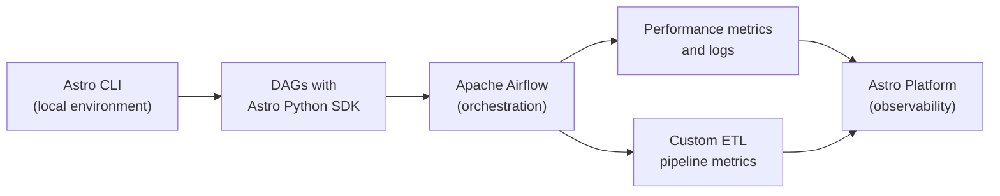

# Astro Python SDK

[← Back to Data Engineering](https://github.com/joycequoos/Data_Enginer/blob/main/README.md)

Reference guide on the **Astro Python SDK**, the **Astro CLI**, and how they relate to Apache Airflow in ETL pipeline development.

## Table of Contents

- [What the Astro Python SDK Is](#what-the-astro-python-sdk-is)
- [Main Characteristics](#main-characteristics)
- [How, When, and Why It Came About](#how-when-and-why-it-came-about)
- [License](#license)
- [Installing the Astro CLI](#installing-the-astro-cli)
- [The Astro Python SDK in ETL Development](#the-astro-python-sdk-in-etl-development)
- [References](#references)

---

## What the Astro Python SDK Is

The Astro Python SDK is a library developed by **Astronomer** to make it easier to use **Astro**, a data and workflow orchestration environment built on top of Apache Airflow. It allows developers to integrate and interact with Astro's features directly in Python projects, with a simpler interface than working directly with the Airflow API.

> Astronomer is the company behind the commercial distribution of Apache Airflow, offering tools and services that simplify its use in enterprise environments.

## Main Characteristics

| Characteristic | Description |
|---|---|
| **Workflow orchestration** | Makes it easier to create, run, and monitor complex data pipelines. |
| **Integration with data sources** | Supports SQL databases, file systems, APIs, and other sources in a standardized way. |
| **Task automation** | Automates repetitive data manipulation, transformation, and movement tasks. |
| **Simplified interface** | Reduces the complexity of writing "pure" Airflow DAGs for common ETL tasks. |
| **Connectivity and extensibility** | Supports additional connectors, allowing Astro's capabilities to be extended as needed. |

Using the SDK tends to increase the productivity of developers and data engineers, allowing them to focus more on analysis and gaining insights rather than on orchestration complexity.

## How, When, and Why It Came About

**How it came about**
It was created to offer a simpler, more programmatic interface for people working with data orchestration in Apache Airflow, reducing the complexity associated with using the Airflow API directly to write DAGs.

**When it came about**
There isn't a widely documented exact release date, but the SDK was developed over the past few years, as demand grew for more user-friendly orchestration tools. Astronomer has been active in the Airflow ecosystem since its founding in 2018, and the SDK is part of that ongoing effort.

**Why it came about**
Mainly to solve two recurring challenges faced by people who use Airflow day to day:

1. **Airflow's complexity** — writing DAGs directly with Airflow's "raw" API requires dealing with a lot of boilerplate (XComs, operators, explicit dependencies).
2. **Development efficiency** — the SDK abstracts away part of that complexity, allowing ETL logic to be written in a more declarative way.

## License

The Astro Python SDK is **open source** — it's publicly available and can be used, modified, and distributed freely.

Official documentation: [astronomer.io/docs/learn/astro-python-sdk-etl](https://www.astronomer.io/docs/learn/astro-python-sdk-etl)

---

## Installing the Astro CLI

The **Astro CLI** is the command-line tool used to create, run, and manage Astro projects (including local Airflow) on your machine.

Official installation guide: [astronomer.io/docs/astro/cli/install-cli](https://www.astronomer.io/docs/astro/cli/install-cli?tab=windowswithwinget#install-the-astro-cli)

### Step 1 — Install via winget (Windows)

In PowerShell, run:

```powershell
winget install -e --id Astronomer.Astro
```

Confirm the terms by typing `y` when prompted. Winget downloads the installer, verifies the hash, and adds the `astro` alias to the PATH.


> After installation, restart the terminal so the `PATH` environment variable is updated.

### Step 2 — Verify the Installation

Inside your project folder, run:

```powershell
astro
```

If the installation was successful, the CLI displays the welcome ASCII art and the introductory message for the Astro CLI.


### Step 3 — Initialize the Astro Project

Still inside the project directory, run:

```powershell
astro dev init
```

This command downloads the Airflow Runtime development files and initializes the standard structure of an Astro project (Dockerfile, `packages.txt`, `requirements.txt`, `airflow_settings.yaml`, the `dags/` folder, `tests/`, etc.).


### Structure Generated by `astro dev init`

| File/Folder | Function |
|---|---|
| `Dockerfile` | Defines the base Airflow image used in the local environment |
| `requirements.txt` | The project's Python dependencies (e.g., `astro-sdk-python`) |
| `packages.txt` | System (apt) packages required inside the container |
| `airflow_settings.yaml` | Connections, Variables, and Pools pre-configured locally |
| `dags/` | Where the project's DAG files live |
| `tests/` | Automated tests for the DAGs |
| `.env` | Local environment variables |

### Next Steps After Initializing

```powershell
astro dev start
```

Brings up the local Airflow environment (webserver, scheduler, database) via Docker, using the structure created by `astro dev init`.

| Command | What It Does |
|---|---|
| `astro dev start` | Brings up the local Airflow environment |
| `astro dev stop` | Stops the environment without removing the containers |
| `astro dev restart` | Restarts the environment (useful after changing `requirements.txt`) |
| `astro dev kill` | Removes the local environment's containers and volumes |
| `astro dev logs` | Displays the local environment's logs |

---

## The Astro Python SDK in ETL Development

The Astro Python SDK is especially useful for **ETL (Extract, Transform, Load)** processes in Airflow, particularly when combined with the Astro platform for observability and management.



### 1. Monitoring and Observability

Airflow orchestrates the ETL workflows, and the Astro Python SDK improves the observability of these workflows:

- **Performance metrics** — execution time, task success/failure, and other DAG indicators.
- **Logs and alerts** — sending detailed logs and error events to the Astro platform, helping to identify and fix problems quickly (task failures, anomalous execution times, etc.).

### 2. Data Collection and Custom Metrics

During ETL pipeline development, it's possible to define **custom metrics** relevant to the workflow and send them to the Astro platform for deeper analysis.

Integrating the Astro Python SDK into the Airflow environment adds a layer of monitoring and control over ETL processes, contributing to the quality and reliability of data pipelines.

---

## References

- [Astro Python SDK Documentation for ETL](https://www.astronomer.io/docs/learn/astro-python-sdk-etl)
- [Astro CLI Installation](https://www.astronomer.io/docs/astro/cli/install-cli?tab=windowswithwinget#install-the-astro-cli)
- [Official astro-sdk Repository (GitHub)](https://github.com/astronomer/astro-sdk)
