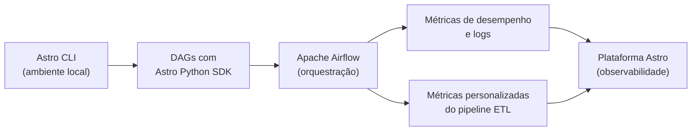

# Astro Python SDK

[← Voltar a Engenharia de Dados](https://github.com/joycequoos/Data_Enginer/blob/main/README.md)

Guia de referência sobre o **Astro Python SDK**, o **Astro CLI** e como eles se relacionam com o Apache Airflow no desenvolvimento de pipelines ETL.

## Índice

- [O que é o Astro Python SDK](#o-que-é-o-astro-python-sdk)
- [Características principais](#características-principais)
- [Como, quando e por que surgiu](#como-quando-e-por-que-surgiu)
- [Licença](#licença)
- [Instalação do Astro CLI](#instalação-do-astro-cli)
- [Astro Python SDK no desenvolvimento de ETL](#astro-python-sdk-no-desenvolvimento-de-etl)
- [Referências](#referências)

---

## O que é o Astro Python SDK?

O Astro Python SDK é uma biblioteca desenvolvida pela **Astronomer** para facilitar o uso do **Astro**, um ambiente de orquestração de dados e workflows construído sobre o Apache Airflow. Ele permite que desenvolvedores integrem e interajam com as funcionalidades do Astro diretamente em projetos Python, com uma interface mais simples do que trabalhar diretamente com a API do Airflow.

> A Astronomer é a empresa por trás da distribuição comercial do Apache Airflow, oferecendo ferramentas e serviços que simplificam seu uso em ambientes corporativos.

## Características principais

| Característica | Descrição |
|---|---|
| **Orquestração de workflows** | Facilita a criação, execução e monitoramento de pipelines de dados complexos. |
| **Integração com fontes de dados** | Suporta bancos SQL, sistemas de arquivos, APIs e outras fontes de forma padronizada. |
| **Automação de tarefas** | Automatiza tarefas repetitivas de manipulação, transformação e movimentação de dados. |
| **Interface simplificada** | Reduz a complexidade de escrever DAGs "puras" do Airflow para tarefas comuns de ETL. |
| **Conectividade e extensibilidade** | Suporta conectores adicionais, permitindo estender as capacidades do Astro conforme a necessidade. |

O uso do SDK tende a aumentar a produtividade de desenvolvedores e engenheiros de dados, permitindo focar mais em análise e obtenção de insights do que na complexidade de orquestração.

## Como, quando e por que surgiu

**Como surgiu**
Foi criado para oferecer uma interface mais simples e programática para quem trabalha com orquestração de dados no Apache Airflow, reduzindo a complexidade associada ao uso direto da API do Airflow para escrever DAGs.

**Quando surgiu**
Não há uma data exata de lançamento amplamente documentada, mas o SDK foi desenvolvido nos últimos anos, à medida que cresceu a demanda por ferramentas de orquestração mais amigáveis. A Astronomer atua no ecossistema Airflow desde sua fundação, em 2018, e o SDK é parte desse esforço contínuo.

**Por que surgiu**
Principalmente para resolver dois desafios recorrentes de quem usa Airflow no dia a dia:

1. **Complexidade do Airflow** — escrever DAGs diretamente com a API "crua" do Airflow exige lidar com bastante boilerplate (XComs, operadores, dependências explícitas).
2. **Eficiência no desenvolvimento** — o SDK abstrai parte dessa complexidade, permitindo escrever lógica de ETL de forma mais declarativa.

## Licença

O Astro Python SDK é **open-source** — está disponível publicamente e pode ser usado, modificado e distribuído livremente.

Documentação oficial: [astronomer.io/docs/learn/astro-python-sdk-etl](https://www.astronomer.io/docs/learn/astro-python-sdk-etl)

---

## Instalação do Astro CLI

O **Astro CLI** é a ferramenta de linha de comando usada para criar, rodar e gerenciar projetos Astro (incluindo Airflow local) na máquina.

Guia oficial de instalação: [astronomer.io/docs/astro/cli/install-cli](https://www.astronomer.io/docs/astro/cli/install-cli?tab=windowswithwinget#install-the-astro-cli)

### Passo 1 — Instalar via winget (Windows)

No PowerShell, execute:

```powershell
winget install -e --id Astronomer.Astro
```

Confirme os termos digitando `y` quando solicitado. O winget faz o download do instalador, verifica o hash e adiciona o alias `astro` ao PATH.


> Após a instalação, reinicie o terminal para que a variável de ambiente `PATH` seja atualizada.

### Passo 2 — Verificar a instalação

Dentro da pasta do seu projeto, rode:

```powershell
astro
```

Se a instalação foi bem-sucedida, o CLI exibe a arte ASCII de boas-vindas e a mensagem de introdução ao Astro CLI.


### Passo 3 — Inicializar o projeto Astro

Ainda no diretório do projeto, execute:

```powershell
astro dev init
```

Esse comando baixa os arquivos de desenvolvimento do Airflow Runtime e inicializa a estrutura padrão de um projeto Astro (Dockerfile, `packages.txt`, `requirements.txt`, `airflow_settings.yaml`, pasta `dags/`, `tests/`, etc.).


### Estrutura gerada pelo `astro dev init`

| Arquivo/Pasta | Função |
|---|---|
| `Dockerfile` | Define a imagem base do Airflow usada no ambiente local |
| `requirements.txt` | Dependências Python do projeto (ex: `astro-sdk-python`) |
| `packages.txt` | Pacotes de sistema (apt) necessários no container |
| `airflow_settings.yaml` | Connections, Variables e Pools pré-configurados localmente |
| `dags/` | Onde ficam os arquivos de DAGs do projeto |
| `tests/` | Testes automatizados das DAGs |
| `.env` | Variáveis de ambiente locais |

### Próximos passos após inicializar

```powershell
astro dev start
```

Sobe o ambiente Airflow local (webserver, scheduler, banco) via Docker, usando a estrutura criada pelo `astro dev init`.

| Comando | O que faz |
|---|---|
| `astro dev start` | Sobe o ambiente Airflow local |
| `astro dev stop` | Para o ambiente sem remover os containers |
| `astro dev restart` | Reinicia o ambiente (útil após alterar `requirements.txt`) |
| `astro dev kill` | Remove os containers e volumes do ambiente local |
| `astro dev logs` | Exibe os logs do ambiente local |

---

## Astro Python SDK no desenvolvimento de ETL

O Astro Python SDK é especialmente útil para processos **ETL (Extract, Transform, Load)** no Airflow, sobretudo quando combinado à plataforma Astro para observabilidade e gerenciamento.



### 1. Monitoramento e observabilidade

O Airflow orquestra os workflows de ETL, e o Astro Python SDK melhora a observabilidade desses workflows:

- **Métricas de desempenho** — tempo de execução, sucesso/falha das tarefas e outros indicadores das DAGs.
- **Logs e alertas** — envio de logs detalhados e eventos de erro para a plataforma Astro, ajudando a identificar e corrigir problemas rapidamente (falhas de tarefas, tempos de execução anômalos, etc.).

### 2. Coleta de dados e métricas personalizadas

Durante o desenvolvimento dos pipelines ETL, é possível definir **métricas personalizadas** relevantes para o fluxo de trabalho e enviá-las para a plataforma Astro para análises mais aprofundadas.

Integrar o Astro Python SDK ao ambiente Airflow adiciona uma camada de monitoramento e controle sobre os processos ETL, contribuindo para a qualidade e confiabilidade dos pipelines de dados.

---

## Referências

- [Documentação do Astro Python SDK para ETL](https://www.astronomer.io/docs/learn/astro-python-sdk-etl)
- [Instalação do Astro CLI](https://www.astronomer.io/docs/astro/cli/install-cli?tab=windowswithwinget#install-the-astro-cli)
- [Repositório oficial astro-sdk (GitHub)](https://github.com/astronomer/astro-sdk)
